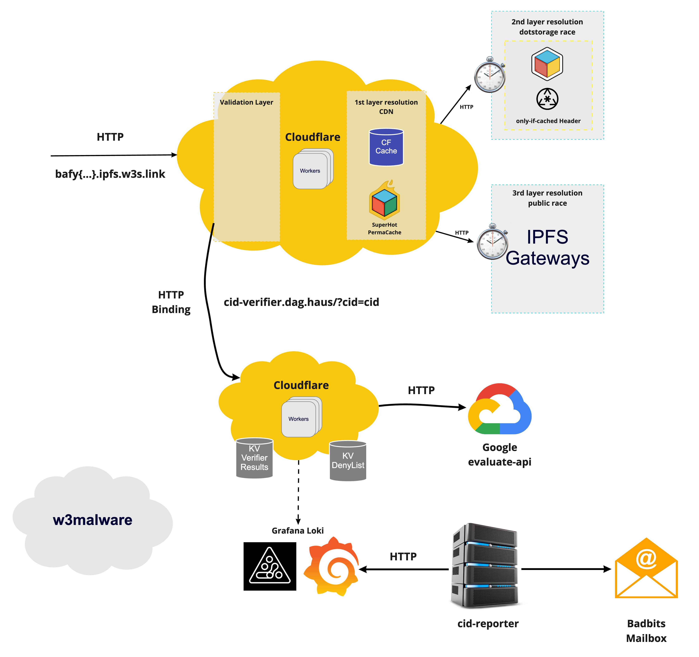

# cid-verifier

> The `cid-verifier` for dotstorage reads pipeline. It relies on third party services to evaluate whether a given content is malicious or not. It keeps track of obtained results for each CID and operates the dotstorage denylist.

## Getting started

- `pnpm install` - Install the project dependencies from the monorepo root directory.
- `pnpm dev` - Run the worker in dev mode.

## Environment setup

- Add secrets

  ```sh
    wrangler secret put SENTRY_DSN --env $(whoami) # Get from Sentry
    wrangler secret put LOKI_URL --env $(whoami) # Get from Loki
    wrangler secret put LOKI_TOKEN --env $(whoami) # Get from Loki
    wrangler secret put GOOGLE_CLOUD_API_URL --env $(whoami) # Get from 1password
    wrangler secret put GOOGLE_CLOUD_API_KEY --env $(whoami) # Get from 1password
    wrangler secret put BASIC_AUTH_TOKENS --env $(whoami) # JSON String with array of allowable auth tokens (eg. echo -e '["Zm9vOmZvbw==","em9vOnpvbw=="]' | wrangler secret ...)
  ```

- `pnpm run publish` - Publish the worker under desired env. An alias for `wrangler publish --env $(whoami)`

## High level architecture



## Contributing

Feel free to join in. All welcome. [Open an issue](https://github.com/web3-storage/reads/issues)!

If you're opening a pull request, please see the [guidelines in DEVELOPMENT.md](https://github.com/web3-storage/reads/blob/main/DEVELOPMENT.md#how-should-i-write-my-commits) on structuring your commit messages so that your PR will be compatible with our [release process](https://github.com/web3-storage/reads/blob/main/DEVELOPMENT.md#release).

## License

Dual-licensed under [MIT + Apache 2.0](https://github.com/web3-storage/reads/blob/main/LICENSE.md)
